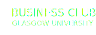

<!-- PROJECT LOGO -->
<br />
<p align="center">
  <a href="https://github.com/bystran/business-club">
    
  </a>

  <h3 align="center">Glasgow University Business Club</h3>

  <p align="center">
    Landing page for the Glasgow University Business Club, which provides students with academic, professional and social opportunities to form a strong network of Business enthusiasts.
    <br />
    <br />
    <a href="https://gubusiness.club">View the website</a>
    ·
    <a href="https://github.com/bystran/business-club/issues">Report Bug</a>
    ·
    <a href="https://github.com/bystran/business-club/issues">Request Feature</a>
  </p>
</p>


<!-- TABLE OF CONTENTS -->
<details open="open">
  <summary><h2 style="display: inline-block">Table of Contents</h2></summary>
  <ol>
    <li>
      <a href="#about-the-project">About The Project</a>
      <ul>
        <li><a href="#built-with">Built With</a></li>
      </ul>
    </li>
    <li>
      <a href="#getting-started">Getting Started</a>
      <ul>
        <li><a href="#installation">Installation</a></li>
      </ul>
    </li>
    <li><a href="#roadmap">Roadmap</a></li>
    <li><a href="#contributing">Contributing</a></li>
    <li><a href="#contact">Contact</a></li>
  </ol>
</details>


<!-- ABOUT THE PROJECT -->
## About The Project

[](https://gubusiness.club)

###
A landing page for the Glasgow University Business club. It's built using react and amplify cli with amplify admin ui. For more infomation have a look at the links below. 


### Built With

* [React.js](https://reactjs.org/)
* [AWS Amplify](https://aws.amazon.com/amplify/)
* [SCSS](https://sass-lang.com/)


<!-- GETTING STARTED -->
## Getting Started

To get a local copy up and running follow these simple steps.

### Installation

1. Clone the repo
   ```sh
   git clone https://github.com/bystran/business-club.git
   ```
2. Install NPM packages
   ```sh
   npm install
   ```
3. Install amplify cli globally
    ```sh
    npm install -g @aws-amplify/cli
    ```
    [Read more](https://docs.amplify.aws/cli/start/install) 
4. Pull amplify dev environment
    ```sh
    amplify pull --appId d194viaet7ay5x --envName dev
    ````
5. Start React Application 
    ```sh
    npm start
    ````

This will start the react application listening on http://localhost:3000

<!-- ROADMAP -->
## Roadmap

See the [open issues](https://github.com/bystran/business-club/issues) for a list of proposed features (and known issues).


<!-- CONTRIBUTING -->
## Contributing


1. Fork the Project
2. Create your Feature Branch (`git checkout -b feature/AmazingFeature`)
3. Commit your Changes (`git commit -m 'Add some AmazingFeature'`)
4. Push to the Branch (`git push origin feature/AmazingFeature`)
5. Open a Pull Request


<!-- CONTACT -->
## Contact

Adam Bystran - bystran.adam.21@gmail.com


